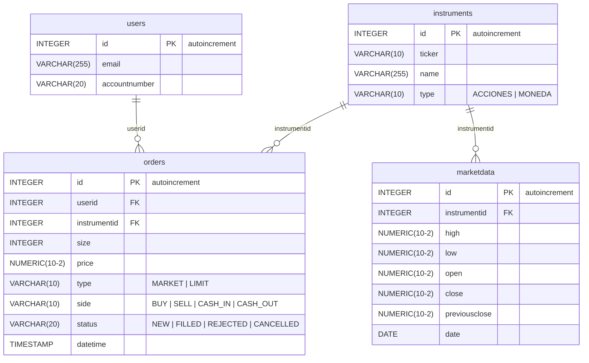

```mermaid
erDiagram
    users {
        INTEGER id PK "autoincrement"
        VARCHAR(255) email
        VARCHAR(20) accountnumber
    }

    instruments {
        INTEGER id PK "autoincrement"
        VARCHAR(10) ticker
        VARCHAR(255) name
        VARCHAR(10) type "ACCIONES | MONEDA"
    }

    marketdata {
        INTEGER id PK "autoincrement"
        INTEGER instrumentid FK
        NUMERIC(10-2) high
        NUMERIC(10-2) low
        NUMERIC(10-2) open
        NUMERIC(10-2) close
        NUMERIC(10-2) previousclose
        DATE date
    }

    orders {
        INTEGER id PK "autoincrement"
        INTEGER userid FK
        INTEGER instrumentid FK
        INTEGER size
        NUMERIC(10-2) price
        VARCHAR(10) type "MARKET | LIMIT"
        VARCHAR(10) side "BUY | SELL | CASH_IN | CASH_OUT"
        VARCHAR(20) status "NEW | FILLED | REJECTED | CANCELLED"
        TIMESTAMP datetime
    }

    instruments ||--o{ marketdata : "instrumentid"
    users ||--o{ orders : "userid"
    instruments ||--o{ orders : "instrumentid"
```